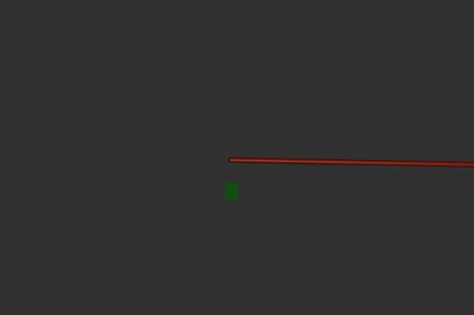

# Dynamics Grasping of Rope

This contains an example model with a rope and an equality constraint.
The script will move the gripper forward, activate the equality constraint to simulat grasping, then drag the rope to the left.
The general is to create an inactive equality constraint for all pairs of geoms you may want in advance, then modify eq_data and eq_active from your script.

## Dependencies

    pip install mujoco

## Run it

python ./dynamic_grasp_demo.py

The MuJoCo viewer will open and the gripper will move.

